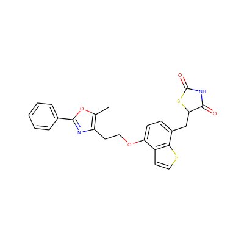
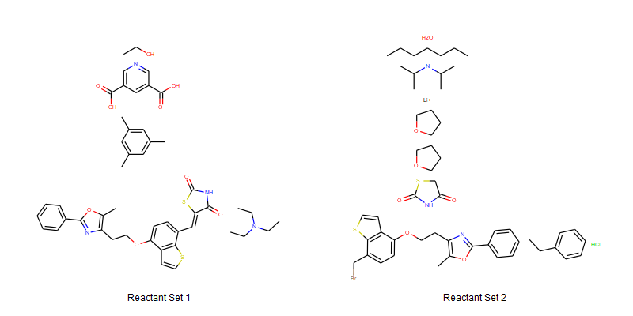
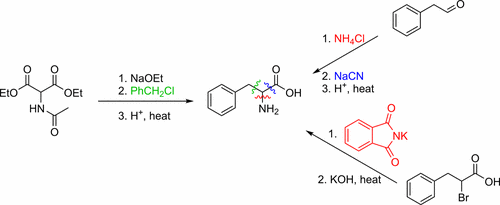
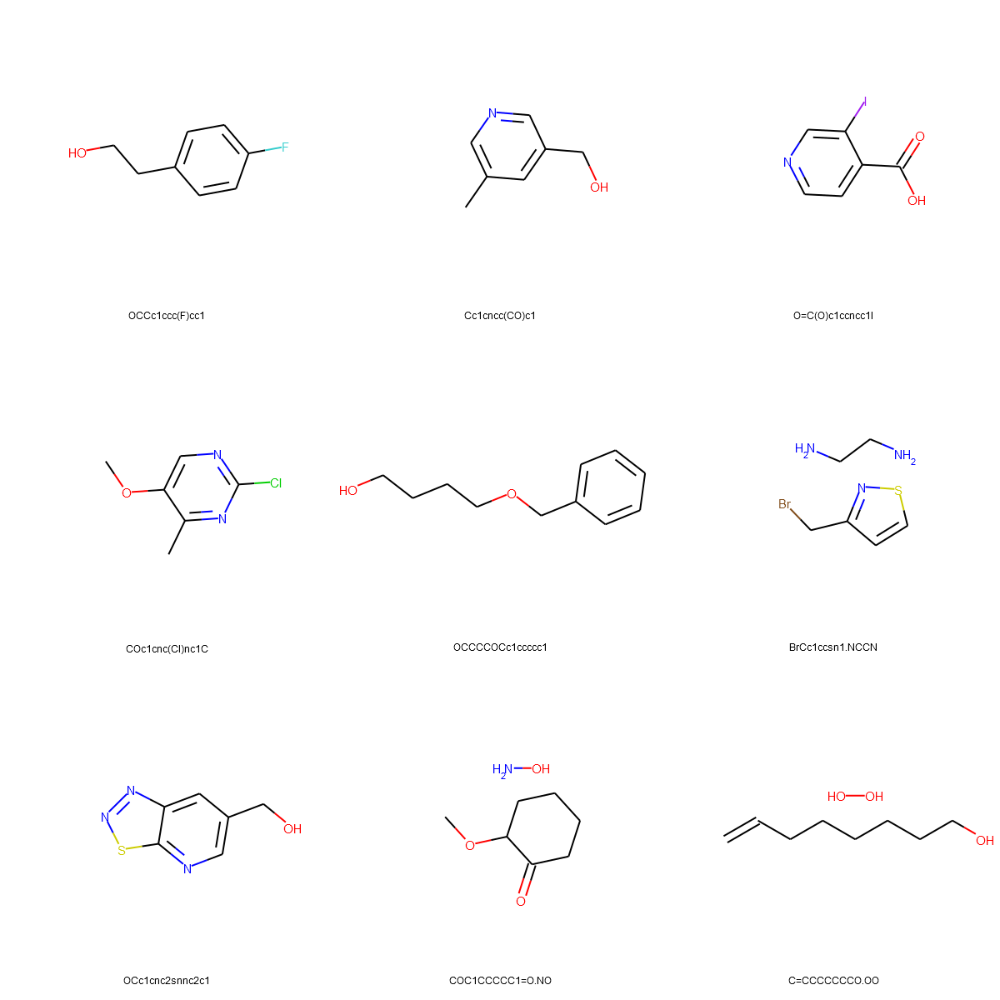
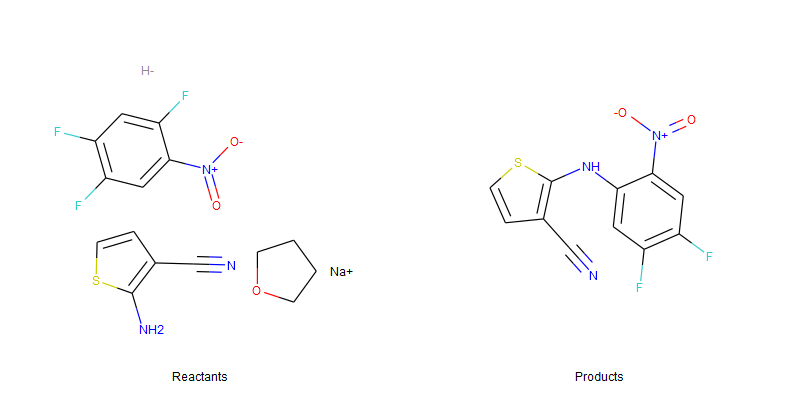
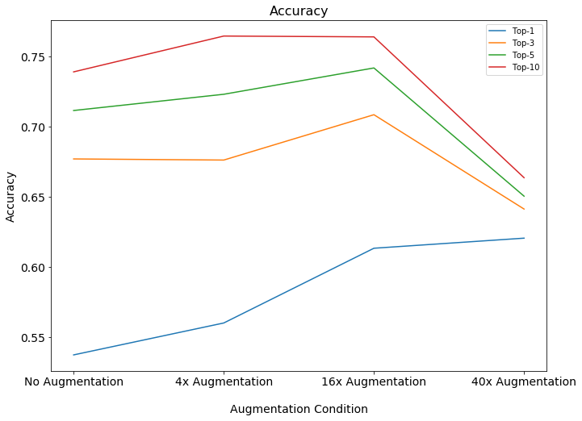
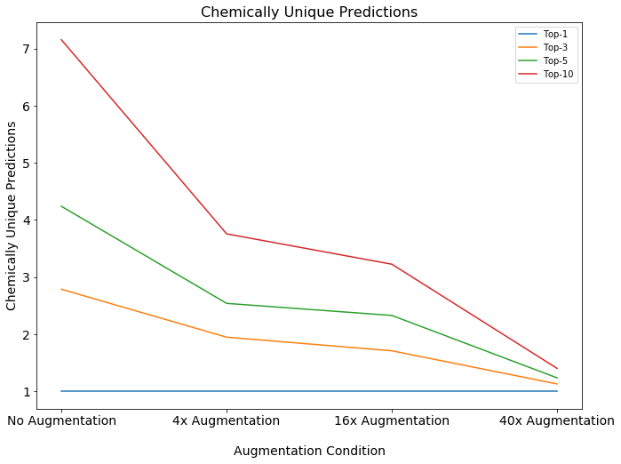

# Retrosynthesis Reaction Prediction with SMILES Augmentation

This repo details experiments on predicting retrosynthesis reactants from products using neural machine translation and SMILES based data augmentation.

## Overview and Results

We trained a transformer sequence to sequence model for retrosynthesis reactant prediction and experimented with the effect of SMILES based augmentation. We find that SMILES based augmentation increases Top 1 accuracy, but can lead to a decrease in Top K accuracy due to the model predicting different SMILES variants of the same molecule. These are results on the USPTO_50k benchmark retrosynthesis dataset relative to published results by [Liu et al](https://pubs.acs.org/doi/10.1021/acscentsci.7b00303) and [Lin et al](https://arxiv.org/abs/1906.02308). For a full description of the problem, data representation, SMILES augmentation, model implementation and results analysis, see the full document below.

|     Model        | Top-1 Accuracy | Top-3 Accuracy | Top-5 Accuracy | Top-10 Accuracy |
|------------------|----------------|----------------|----------------|-----------------|
| Liu et al        |      37.4      |      52.4      |       57       |       61.7      |
| Lin et al        |      54.6      |      __74.8__      |      __80.2__      |       __84.9__      |
| No Augmentation  |      53.7      |      67.7      |      71.2      |       73.9      |
| 4x Augmentation  |      56.0      |      67.6      |      72.3      |       76.5      |
| 16x Augmentation |      61.3      |      70.9      |      74.2      |       76.4      |
| 40x Augmentation |      __62.1__      |      64.1      |      65.0      |       66.4      |

## Repository Structure

    │   README.md
    │
    ├───model_details
    │       model_config.yml
    │       predictions.zip
    │       README.md
    │
    └───notebooks
            Data Generation.ipynb
            Prediction Evaluation.ipynb
        
The `notebooks` directory contains notebooks showing how to generate the SMILES augmented datasets (`Data Generation`) and how to evaluate model predictions (`Prediction Evaluation`). The `model_details` directory contains additional details on implementing the sequence to sequence transformer model using OpenNMT. `model_convig.yml` is a basic configuration file to recreate the training process. The `README` file in the `model_details` directory contains instructions on preprocessing data, training the model using the config file and generating predictions. The `predictions.zip` file contains predictions used to generate the results above.

## What is Retrosynthesis?

Organic synthesis is is the study of creating molecules through chemical reactions. Synthesis is often thought of as developing a pathway that will map some precursor compounds through a series of reactions to create a desired product. Good synthetic routes maximize speed, cost and yield while minimizing off target products. When an organic compound needs to be produced at scale, choosing the right synthetic route can have a major impact on the cost of production. Often, organic chemists find themselves in the position of planning reaction pathways out in reverse. Starting from the desired product molecule, how do we develop the most efficient synthesis pathway? This brings us to the problem of Retrosynthesis. Retrosynthesis is the process of taking some target molecule and working backwards iteratively to break the target molecule into simpler precursor molecules until all reactions start from a set of precursors that are cheap and widely available.

Retrosynthesis is hard. A major challenge is that the relationship between reactants and products has a many to one mapping. A specific target molecule can be made through multiple different synthetic routes. Consider the following product molecule:

This molecule can be generated using either of the following reactant sets:

In fact, every carbon to carbon bond in the product molecule is potentially a different synthetic route. For example:

[source](https://pubs.acs.org/doi/10.1021/acscentsci.7b00303)

How do you choose which one is better? We can determine the criteria easily - we want the reaction that maximizes speed, yield, specificity (lack of off target products) and cost. Actually quantifying these metrics is another matter. If there is no literature on the specific reaction, it falls to an expert organic chemist. The chemist must use their knowledge of reaction mechanisms to estimate off target products. Yield must be determined experimentally, which takes time.

This process must be conducted iteratively at all levels of pathway planning. It's time consuming and relies on domain experts and their ability to keep thousands of reaction mechanisms in mind at all steps. Because of the challenge of this process, many computational tools have been developed to aid retrosynthesis planning.

## Computational Retrosynthesis

The difficulty of the Retrosynthesis problem has lead to a number of computational tools designed to assist chemists in planning synthetic routes. One way of developing a retrosynthesis algorithm is to use symbolic logic and expert designed rules. Rules based algorithms use specific reation rules defined by expert chemists in conjunction with a large database of known reactions to make retrosynthesis predictions. The problem with these systems is they generalize very poorly outside their specific rule set. This restricts the usefulness of rules based algorithms to simple targets, which are not particularly useful. 

Other algorithms use physical chemistry calculations to predict reaction energy barriers and likely products from first principals. This class of algorithms generalize much better to novel molecules, but are computationally prohibitive.

More recently, machine learning algorithms have been combined with rules based algorithms to improve performance, but have not escaped the generalization drawbacks of rules based systems. This has motivated fully machine learning based solutions to retrosyntehsis prediction.

## Deep Learning for Retrosynthesis

Deep learning was first applied to Retrosynthesis (to my knowledge) in 2017 by the [Liu et al](https://pubs.acs.org/doi/10.1021/acscentsci.7b00303). Liu et al framed the problem of Retrosynthesis prediction as a squence to sequence problem. The authors created a benchmark dataset of 50,000 reactant/product pairs with known reaction mechanisms. Liu et al used LSTM based sequence to sequence models and achieved 37.4% top-1 prediction accuracy compared to a rules based template matching model which achieved 35.4% top-1 accuracy.

Earlier this year (2019), [Lin et al](https://arxiv.org/abs/1906.02308) followed up on the results of Liu, using transformer based models for the sequence to sequence task. Lin et al achieved 54.6% top-1 accuracy on the benchmark dataset.

This repo shows how using specific data augmentation techniques for the sequence to sequence task can boost top-1 accuracy to 64%. But first, we need to discuss how exactly we can model reaction prediction as a sequence to sequence task.

## Text Representations of Chemical Reactions

In a sequence to sequence problem, our model takes as input a sequence of tokens and produces as output a new sequence of tokens. How do we represent chemical reactions as token sequence? We use SMILES strings.

[Simplified Molecular-Input Line-Entry System](https://en.wikipedia.org/wiki/Simplified_molecular-input_line-entry_system) strings or SMILES strings are a way of representing organic molecules as text strings in such a way that the structure of the molecule is captured in the SMILES string. For example:

So we can represent the following reaction:

as `N#Cc1ccsc1N.O=[N+]([O-])c1cc(F)c(F)cc1F.C1CCOC1.[H-].[Na+] >> N#Cc1ccsc1Nc1cc(F)c(F)cc1[N+](=O)[O-]`

From a retrosynthesis standpoint, the product `N#Cc1ccsc1Nc1cc(F)c(F)cc1[N+](=O)[O-]` would be the input to the model, and the reactants `N#Cc1ccsc1N.O=[N+]([O-])c1cc(F)c(F)cc1F.C1CCOC1.[H-].[Na+]` would be the output.

## Developing a Dataset for Retrosynthesis

This repo shows results on the benchmark retrosynthesis dataset created by Liu et al. It's important to point out some of the concessions made in creating that dataset. There are many factors that go into *truly* predicting a synthetic pathway. A full synthesis prediction would include things like reagents, reaction conditions and yield. Liu et al simplified the Retrosynthesis problem by removing all reagents from the data, so the model is predicting only over main reactants.

Reactions with multiple products are broken up so that each item in the dataset consists of one major product being formed by some reaction.

The dataset also classifies each reaction into ten different reaction categories.

| Reaction Class |              Reaction Name             |
|:--------------:|:--------------------------------------:|
|        1       |   heteroatom alkylation and arylation  |
|        2       |     acylation and related processes    |
|        3       |           C–C bond formation           |
|        4       |          heterocycle formation         |
|        5       |               protections              |
|        6       |              deprotections             |
|        7       |               reductions               |
|        8       |               oxidations               |
|        9       | functional group interconversion (FGI) |
|       10       |     functional group addition (FGA)    |

A token representing the reaction type is prepended to the product SMILES as part of the input to the model. This greatly constrains the set of possible reactants and makes the prediction problem easier.

After all these stages of filtering, a final datapoint might look like this:

Input: `<RX_6> C/C=C/c1cc(C(=O)O)c(F)cc1OCC12CC3CC(CC(C3)C1)C2`

Output: `C/C=C/c1cc(C(=O)OC(C)(C)C)c(F)cc1OCC12CC3CC(CC(C3)C1)C2`

## SMILES-Based Data Augmentation

Data augmentation is a collection of methods that allow us to modify our dataset to appear to have more unique data points than it really does. Data augmentation techniquesfor images such as flipping, rotating or cropping images, are widely used in computer vision. Representing molecules as SMILES strings allows us to use specific data augmentation strategies.

Organic molecules are commonly represented as graphs. SMILES strings contain all the same information as a molecular graph, and one can easily convert between representations. Similar to how a specific graph can have multiple valid representations, a molecule can have multiple valid SMILES strings. For example, the following SMILES all represent the same molecule:

    c1([C@@]2(OC(=O)CC)CC[NH+](C)C[C@H]2CC=C)ccccc1
    c1ccc([C@]2(OC(=O)CC)[C@H](CC=C)C[NH+](C)CC2)cc1
    c1ccccc1[C@@]1(OC(CC)=O)CC[NH+](C)C[C@H]1CC=C
    O=C(CC)O[C@]1(c2ccccc2)CC[NH+](C)C[C@H]1CC=C
    C[NH+]1CC[C@](OC(=O)CC)(c2ccccc2)[C@H](CC=C)C1
    C1[C@@](c2ccccc2)(OC(CC)=O)[C@H](CC=C)C[NH+](C)C1
    [C@]1(c2ccccc2)(OC(=O)CC)CC[NH+](C)C[C@H]1CC=C
    c1([C@@]2(OC(CC)=O)CC[NH+](C)C[C@H]2CC=C)ccccc1
    [C@@H]1(CC=C)C[NH+](C)CC[C@]1(OC(=O)CC)c1ccccc1
    c1cccc([C@@]2(OC(=O)CC)CC[NH+](C)C[C@H]2CC=C)c1

Typically a SMILES representation of a molecule is put through a canonicalization algorithm to set a specific standard representation for each molecule.

We can use different valid SMILES representations to augment our dataset. This technique was proposed by [Bjerrum](https://arxiv.org/abs/1703.07076) and implemented in this [repo](https://github.com/EBjerrum/SMILES-enumeration).

This technique was used by [Schwaller et al](https://arxiv.org/abs/1811.02633) in the task of synthesis prediction and showed an overall accuracy improvement.

## SMILES Based Data Augmentation for Retrosynthesis 

The standard retrosynthesis training dataset consists of 40,000 examples. Three augmented versions of the dataset were generated - 
  * 4x Augmentation - 160,000 examples
  * 16x Augmentation - 640,000 examples
  * 40x Augmentation - 1,560,000 examples
  
Code for generating the dataset can be found in the [Data Generation Notebook](https://github.com/kheyer/Retrosynthesis-Prediction/blob/master/notebooks/Data%20Generation.ipynb).

The data files themselves can be found [here](https://www.dropbox.com/s/ze4bdif8sqjx5jx/Retrosynthesis%20Data.zip?dl=0)

A sequence 2 sequence model was trained on each dataset to predict reactant SMILES from product SMILES. Each model was evaluated on the test set used by [Liu et al](https://pubs.acs.org/doi/10.1021/acscentsci.7b00303). Following the results of [Lin et al](https://arxiv.org/abs/1906.02308), a Transformer sequence to sequence model was used. The model was implemented in Pytorch using the [OpenNMT](https://github.com/OpenNMT/OpenNMT-py) library (would highly recommend).

The full configuration file for the transformer model used can be found [here](https://github.com/kheyer/Retrosynthesis-Prediction/blob/master/model_details/model_config.yml) in the model details directory. Here are some select properties on the model size used.

| Property        | Value  |
|-----------------|--------|
| Embedding Dim   | 256    |
| Model Dim       | 256    |
| Feedforward Dim | 2048   |
| Heads           | 8      |
| Layers          | 6      |
| Iterations      | 100000 |

## Results

For each dataset, a model was trained then used to predict on the test dataset. Models were evaluated at Top 1, 3, 5, and 10 accuracy. Here are our results compared to Liu et al and Lin et al:

|     Model        | Top-1 Accuracy | Top-3 Accuracy | Top-5 Accuracy | Top-10 Accuracy |
|------------------|----------------|----------------|----------------|-----------------|
| Liu et al        |      37.4      |      52.4      |       57       |       61.7      |
| Lin et al        |      54.6      |      __74.8__      |      __80.2__      |       __84.9__      |
| No Augmentation  |      53.7      |      67.7      |      71.2      |       73.9      |
| 4x Augmentation  |      56.0      |      67.6      |      72.3      |       76.5      |
| 16x Augmentation |      61.3      |      70.9      |      74.2      |       76.4      |
| 40x Augmentation |      __62.1__      |      64.1      |      65.0      |       66.4      |

We compare results to Lin et al (the Lin model), as the authors also used a transformer model on the same dataset. The Lin model achieves similar Top-1 performance to our No Augmentation model. The 4x, 16x and 40x augmentation models all achieve a higher Top-1 accuracy than the Lin model.

The Lin model performs better in terms of Top 3, 5 and 10 accuracy. This has puzzled me, especially in terms of the comparison to Top 1 accuracy after being trained on the same dataset. Lin et al specify they generate a new Train/Valid/Test split of the Liu et al dataset following the same percent split, so that could be a source of variation. Ther could also be an difference in the implementation of beam search used to generate top-k predictions. Lin et al do not specify the prediction implementation.

Comparing results between augmented datasets, we see interesting trends in Top 1 vs Top k accuracy. As the number of augmented examples increases, Top 1 accuracy increases. Meanwhile, Top k accuracy increases to a point, then decreases.

The reason for this is quite interesting. When you train on a large number of augmented SMILES, the model learns to predict different augmented versions of the same SMILES. What this means is that many of your Top k predictions are actually the same molecule predicted in a different way. We see this clearly when we look at the average number of chemically unique, canonicalized predictions.

In a sense, Top k accuracy is no longer truly Top k because you are evaluating over a much smaller set of unique predictions. To avoid this, one would need to create a sort of chemically constrained beam search that would filter out multiple predictions of the same SMILES.

Overall, using 16x augmentation of the dataset appears to hit the sweet spot. The Top 1 accuracy is almost the same as the 40x augmented data without losing performance on Top 3, 5 and 10 accuracy.

To further compare to Liu et al and Lin et al, we look at Top 10 accuracy across different reaction types. Here the column numbers correspond to the reaction classes in the table above.

| Reaction Class, Top 10 Accuracy | 1     | 2     | 3     | 4     | 5     | 6     | 7     | 8     | 9     | 10    |
|---------------------------------|-------|-------|-------|-------|-------|-------|-------|-------|-------|-------|
| Liu et al                       | 57.5 | 74.6 | 46.1 | 27.8 | 80.0 | 62.8 | 67.8 | 69.1 | 47.3 | 56.5 |
| Lin et al                       | __83.1__ | __90.4__ | __76.2__ | 60.0 | 92.3 | __88.6__ | __88.2__ | __86.4__ | __73.9__ | 82.6 |
| No Augmentation                 | 73.4 | 81.7 | 60.5 | 54.4 | 87.7 | 71.3 | 79.1 | 82.7 | 67.4 | 87.0 |
| 4x Augmentation                 | 74.9 | 82.9 | 66.5 | 70.0 | 92.3 | 75.3 | 80.8 | 80.2 | 67.9 | 82.6 |
| 16x Augmentation                | 73.5 | 84.5 | 66.3 | __76.7__ | __93.8__ | 74.7 | 81.9 | 75.3 | 65.8 | __91.3__ |
| 40x Augmentation                | 63.6 | 74.8 | 55.3 | 75.6 | 90.8 | 62.2 | 70.4 | 76.5 | 58.2 | 82.6 |

## Conclusions

SMILES string augmentation is a valid data augmentation method that provides a significant boost to Top 1 accuracy. Using SMILES augmentation boosts Top 1 accuracy from 53.7% to 62.1% over an extablished best Top 1 performance of 54.6%.

A side effect is observed where training on a large number of augmented examples leads to worse Top k accuracy performance due to the model predicting many variants of the same molecule. This motivates either tuning the level of augmentation to a degree where Top k accuracy is not affected, or developing a form of constrained beam search to avoid this issue.
